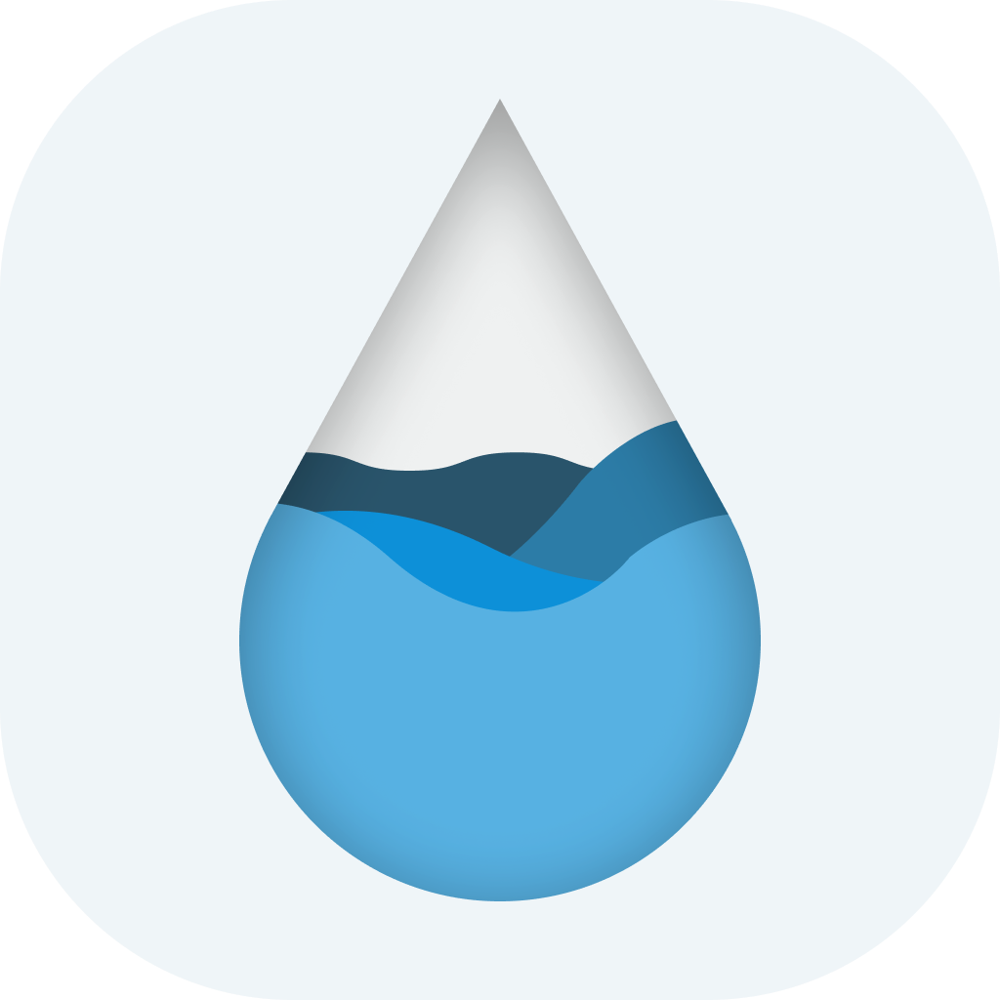

<h1 align=center>Hydrate</h1>

## 📖 Description
📱💻 iOS and macOS application made to track water drinking habits. Made using SwiftUI.

## 🛠 Install
* `git clone https://github.com/qeude/Hydrate.git`
* Add your `GoogleService-Info.plist` from your [Firebase project](http://firebase.google.com) to the root of the project.
* Build the app through Xcode.

## 📦 Dependencies
* [Firebase](https://github.com/firebase/firebase-ios-sdk): Auth, real-time database.
* [SwiftGen](https://github.com/SwiftGen/SwiftGen): Internationalization, Colors, etc...

## 👨🏻‍💻 Developer
* Quentin Eude
    * [Github](https://github.com/qeude)
    * [LinkedIn](https://www.linkedin.com/in/quentineude/)